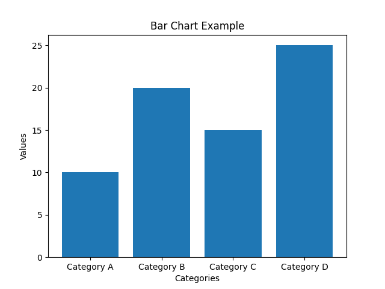
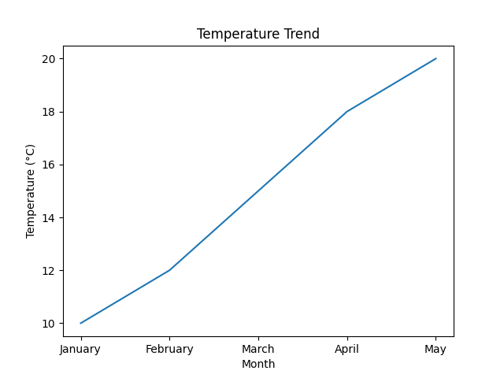
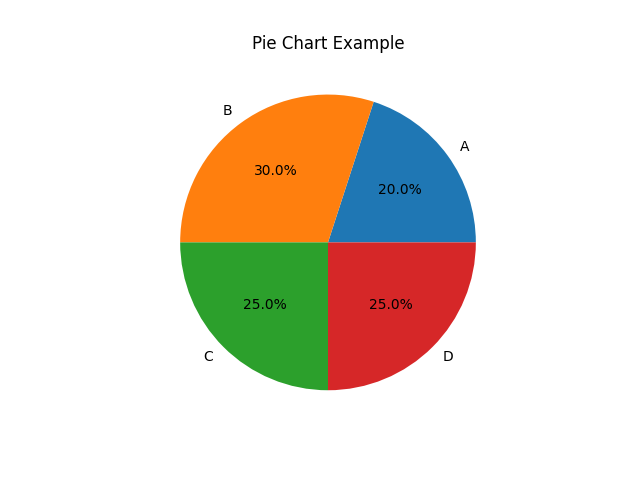
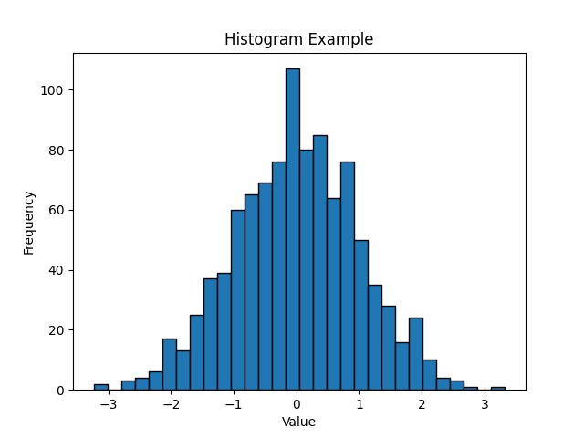
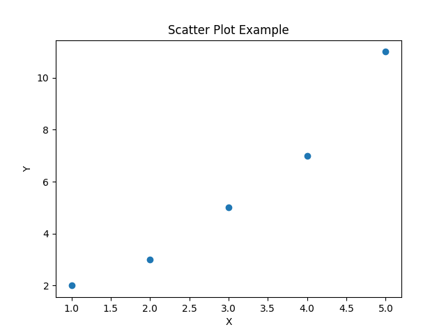

# How Can Trump Do This?

In this project, we analyze various aspects of political decisions made by President Trump.

## Introduction

President Trump's decisions have been a subject of discussion and debate. In this project, we aim to analyze the impact of some of his key policies.

## Data Collection

We collected data from various sources, including government reports, news articles, and public opinion surveys.

## Analysis Results

### Economic Impact

We begin by examining the economic impact of Trump's policies. Below is a bar chart illustrating the GDP growth rate over the years:

### Immigration Policy

Next, we analyze the effects of Trump's immigration policies. The following pie chart shows the distribution of immigration visas granted:

### Climate Change Policy

We also look into Trump's approach to climate change. Here's a line chart showing the trend of carbon emissions during his presidency:

### Healthcare Policy

Trump's healthcare policies have been a significant point of contention. Below is a histogram depicting the distribution of healthcare coverage among different demographics:

### International Relations

Finally, we examine Trump's approach to international relations. Here's a scatter plot representing diplomatic relations with various countries:

## Conclusion

Through our analysis, we aim to provide insights into the impact of Trump's policies and their implications for the future.
